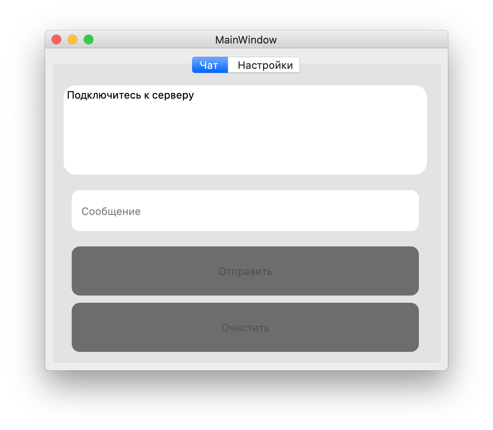

# AkChat
Онлайн чат на Python библиотеке PyQt5.

# Установка и запуск
  - Скачиваем Python 3.8.2, и не ниже (если не установлен)
  - git clone https://github.com/Ak-Ukraine.git
  - Открываем папку с проектом
  - pip3 install pyqt5 (если не установлена библиотека PyQt5)
  - python3 server/server.py
  - python3 main.py
  - Переходим во вкладку настройки
  - Указываем IP, порт и ваше имя
  - Кликаем на кнопку подключиться и пользуемся
  
# Чат находится на этапе тестирования, поэтому возможны ошибки в работе ПО!

# Демонстрация ПО
